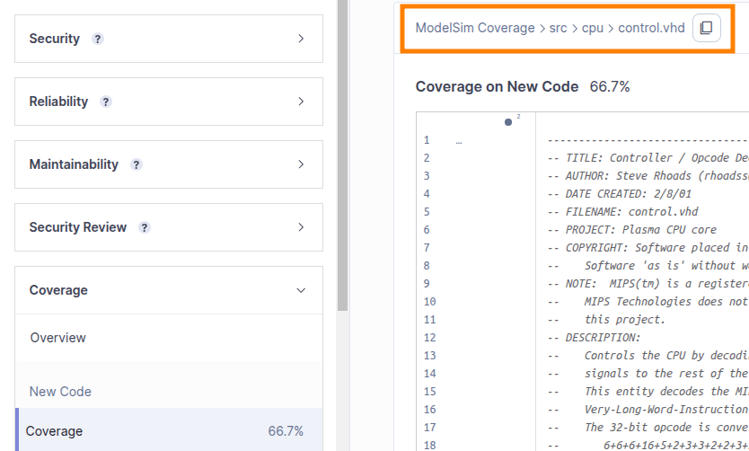

# Linty ModelSim/QuestaSim Plugin

This plugin adds the ability to import ModelSim/QuestaSim XML reports into SonarQube.

## Usage

### Generating Coverage Report from ModelSim/QuestaSim

Coverage report can be generated through the UI or command line.

#### UI

Go to **Tools > Coverage Report > Text**. The **XML format** box must be ticked.
**Code coverage > Statements**, and **Code coverage > Branches** or **Code coverage > Conditions** must be enabled
according to the type of coverage you'd like to import into SonarQube. **Condition/Expression tables** option is
necessary
to import condition coverage. Do not activate other unnecessary options such as **Toggles**.

#### Command Line

Here's an example of command line:

```bash
coverage report -file report.xml -byfile -detail -all -dump -option -code {s b c} –xml
```

### Importing ModelSim/QuestaSim Coverage Report into SonarQube

Add the following properties to your SonarQube analysis configuration:

* `sonar.modelsim.reportPaths`: Comma-separated list of paths (either files or directories) to ModelSim/QuestaSim XML
  report files. If the list contains a directory, all `.xml` files in this directory will be considered as
  ModelSim/QuestaSim XML reports.
* `sonar.modelsim.additionalReportType`: Type of secondary coverage: `branch` or `condition` (branch coverage will still
  be
  reported as condition coverage on the SonarQube web interface). Statement coverage is always imported. Default value
  is `branch`.

Make sure that file paths in XML reports (`fileData > path`) match file paths in Linty.
If not, update your continuous integration process to update paths in XML reports to match paths in Linty.

For instance, `./src/cpu/control.vhd` in below XML report:

```xml
<?xml version="1.0"?>
<coverage_report>
  <code_coverage_report
    lines="1"
    byFile="1">

    <fileData path="./src/cpu/control.vhd">
      <statements active="2" hits="1" percent="50.00"/>
      <stmt ln="31" st="1" hits="4961097"/>
      <stmt ln="35" st="1" hits="3307396"/>
      <branches active="13" hits="5" percent="38.46"/>
    </fileData>

    ...
```

matches file path in Linty:



See project sample
at [https://demo.linty-services.com/dashboard?id=modelsim-coverage](https://demo.linty-services.com/dashboard?id=modelsim-coverage)

## Compatibility Matrix

| ModelSim/QuestaSim Plugin | SonarQube Community     |
|---------------------------|-------------------------|
| 4.0.1                     | 10.7.0 -> 25.2.0.102705 |

## Build Plugin

Without integration tests:

```bash
mvn clean package
```

With integration tests:

```bash
mvn clean verify -Pits
```

Update license headers:

```bash
mvn license:format -Pits
```

## Update All Dependencies

```bash
# Check for Maven dependencies to update
mvn org.codehaus.mojo:versions-maven-plugin:2.18.0:display-dependency-updates -Pits

# Check for Maven plugins to update
mvn org.codehaus.mojo:versions-maven-plugin:2.18.0:display-plugin-updates -Pits

# Check for versions in properties to update
mvn org.codehaus.mojo:versions-maven-plugin:2.18.0:display-property-updates -Pits

# Update parent POM
# Check https://mvnrepository.com/artifact/org.sonarsource.parent/parent
```

### Update Sonar Version

* Update `sonar.version` property in [pom.xml](pom.xml): Sonar version
* Update `sonar.api.version` property in [pom.xml](pom.xml):
  See https://github.com/SonarSource/sonar-plugin-api/releases. Make sure that the version of the API is included in
  Sonar version.
